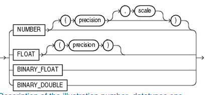

# BASIC ELEMENTS OF ORACLE SQL.

## DATA TYPES.

Oracle Database provides a number of built-in data types as well as several categories for user-defined types that can be used as data types. The syntax of Oracle data types appears in the diagrams that follow. The text of this section is divided into the following sections.


We have some categories for for datatypes.

- Scalar Type: Contains an atomic value.
- Non Scalar Type (Also called collection): Contains a  set of values.
- Large Object (LOB): Representing  a large scalar value of binary or character.


## ORACLE BUILT-IN DATA TYPES.


The oracle Data-types are described in the next image


1. character_datatypes.
2. number_datatypes.
3. long_and_raw_datatypes.
4. data_time_datatypes.
5. large_objects_datatypes.
6. row_id_datatypes.

### CHAR DATA TYPES

### CHAR
```sql
name_variable CHAR (SIZE,  CHAR | BYTE) 
```


Explanation: We can indicate the size and if the number we give in the size is for bytes or characteres. For example.

```sql
my_variable_char CHAR (10 BYTE);
```
Declares a variable char that can support 10 bytes

```sql
my_variable_char CHAR (10 CHAR);
```
Declares a variable of 10 characters.

The Size, BYTE | CHAR are optional.

#### Properties.
Fixed-length character data of length  size bytes or characteres, Maximum size is 2000 bytes or characters, default size is 1 


### VARCHAR2 

```sql
    variable_name VARCHAR (SIZE BYTE|CHAR )
```


#### EXPLANATION:

Variable length character string  having as maxium length SIZE. In this case the SIZE has to be set, it is not optional.
MAX_LENGTH = 32767

#### EXAMPLES  
```sql
    my_variable VARCHAR2(10 CHAR);
```
```sql
    my_variable VARCHAR2(10 BYTE);
```
###  NCHAR Y NVARCHAR2

```sql
variable_name NCHAR(SIZE CHAR)
```

```sql
variable_name NVARCHAR2(SIZE CHAR)
```


This are similar to char and varchar2 the difference is the set of characters they can store, Nchar and Nvarchar can store National Symbols not neccessary from UTF-8 this is because languages like CHINESE use more than one character to be represented.


## NUMBER DATA TYPES.

We have the next numeric data types in oracle database.



### NUMBER

```sql
    variable_name NUMBER ( PRECISION, SCALE) 
```

#### EXPLANATION

- This data type is used to store either an integer number or decimal one.
- We can add Precision and Scale (optionally) where precision is the number of total digits that have our variable and scale are the number of digits that can go to the right of the point (in non integers numbers).

#### EXAMPLES:

```sql
     my_number NUMBER ( 10, 2 )
```
This can store a decimal number of ten digits in total and 2 digits right to the point for example:
    12345678.23 (Valid one)
    123456789.2  (Invalid one)
The second one is invalid because we can only have 8 digits to  the left of the point.

#### RANGES

- Precision (p): from 1 to 38.
- Scale  (s) : from -84 to 127.


### FLOAT.

```sql
    my_variable FLOAT(PRECISION)
```


#### EXPLANATION:

* This is a subtype of the number datatype just having a precision "p" as optional 
* It is used to store values with float point.
* It has precision of 32 bits.

#### EXAMPLE:

```sql
    my_variable FLOAT (Precision)
```

### DOUBLE.

```sql
    my_variable DOUBLE PRECISION
```

#### EXPLANATION:

* This is a subtype of the number datatype.
* It is used to store values with float point.
* This is used when we need much more precision than just using a float number

#### EXAMPLES:

```sql
    create table cinco(mi_variable double precision);
```

### BINARY FLOAT AND BINARY DOUBLE.

```sql
    variable_name BINARY_FLOAT
    variable_name BINARY_DOUBLE
```


#### EXPLANATION:
* These are datatypes used to represent float point numbers in binary format.

* These are specially useful to perform fast operations in applications that require a high efficiency in storing and calculations.

#### EXAMPLE:

```sql
CREATE TABLE ejemplo_binary_float (
    mi_variable BINARY_FLOAT
);

-- Insertar datos
INSERT INTO ejemplo_binary_float VALUES (CAST(123.45 AS BINARY_FLOAT));
INSERT INTO ejemplo_binary_float VALUES (CAST(678.90 AS BINARY_FLOAT));

-- Consultar datos
SELECT * FROM ejemplo_binary_float;
```


### LONG DATATYPE.

```sql
    variable_name LONG
```
#### EXPLANATION:

- It is used to store data of type string with changing length.
- It can store even  a string of 2 GigaBytes.
- Oracle recommends not use this datatype any more and use LOBS instead.

#### EXAMPLE.

```sql
CREATE TABLE ejemplo_long (
    columna_long LONG
);
```

### RAW DATATYPE.
```sql
    variable_name RAW (SIZE)
```
#### EXPLANATION:

* It is used to store binary data.
* Is is commonly used to store binary data such as images or files. 

#### EXAMPLE.

```sql
CREATE TABLE ejemplo_raw (
    columna_raw RAW(100)
);
```


## DATE-TIME DATATYPES

We have the next data-time datatypes in oracle sql.

<center> 


</center>

### DATE

```sql
    variable_name DATE
```

<center>


</center>

#### EXPLANATION:

- This is used to store a date in next format  YYYY-MM-DD.
- It can not store hours or minutes.

#### EXAMPLES:

```sql
    create table fecha_sin_hora (
  	fecha date  
);
INSERT INTO fecha_sin_hora (fecha) VALUES (TO_DATE('2023-01-31', 'YYYY-MM-DD'));

select * from fecha_sin_hora;
```

### TIMESTAMP

```sql
    variable_name TIMESTAMP ( fractional_seconds_precision) WITH LOCAL TIME ZONE.
```
<center>


</center>

#### EXPLANATION.

- This is datatype used to store dates but including hour,minute and second.
- We can add optionally a fractional_second_precision (integer) to specify the number of decimals for the seconds.
- We can also add to this data type the local time zone or whatever time zone.

#### EXAMPLES.

```sql
    CREATE TABLE ejemplo_timestamp (
    fecha_hora_columna TIMESTAMP
);

INSERT INTO ejemplo_timestamp (fecha_hora_columna) VALUES (TO_TIMESTAMP('2023-01-31 12:30:45', 'YYYY-MM-DD HH24:MI:SS'));

SELECT * FROM ejemplo_timestamp;
```

```sql
    CREATE TABLE ejemplo_timestamp (
    fecha_hora_columna TIMESTAMP(6)
);
```
The 6 stands for the miliseconds allowed.

## LARGE OBJECTS 

It is a data type that is used to store variable-length binary or characer data.LOBS are designed to handle large amounts of data, such as text documents, images, audios, and video files which may not fit comfortably in a standard relational database row.


There are three main types of LOBS in Oracle.

1. **CLOB(Character Large Object)**: This type is used for storing large amounts of character data, such as text document. It can store up to 4 Gigabytes of character data.

2. **BLOB(Binary Large Object)**: BLOB is used for storing  binary data, such  as images or multimedia files. It can store  up to 4 gigabytes of binary data.

3. **NCLOB(National Character Large Object)**: Similar to CLOB,but used for storing large amounts of national character set data. It can store up to 4 Gigabytes.


