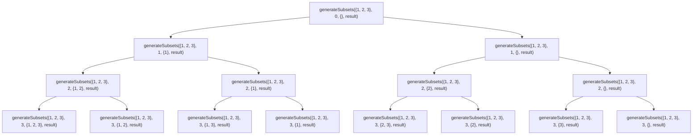

```mermaid
graph TD;
A["generateSubsets({1, 2, 3}, 0, {}, result)"]
A --> B["generateSubsets({1, 2, 3}, 1, {1}, result)"]
B --> C["generateSubsets({1, 2, 3}, 2, {1, 2}, result)"]
C --> D["generateSubsets({1, 2, 3}, 3, {1, 2, 3}, result)"]
C --> E["generateSubsets({1, 2, 3}, 3, {1, 2}, result)"]
B --> F["generateSubsets({1, 2, 3}, 2, {1}, result)"]
F --> G["generateSubsets({1, 2, 3}, 3, {1, 3}, result)"]
F --> H["generateSubsets({1, 2, 3}, 3, {1}, result)"]
A --> I["generateSubsets({1, 2, 3}, 1, {}, result)"]
I --> J["generateSubsets({1, 2, 3}, 2, {2}, result)"]
J --> K["generateSubsets({1, 2, 3}, 3, {2, 3}, result)"]
J --> L["generateSubsets({1, 2, 3}, 3, {2}, result)"]
I --> M["generateSubsets({1, 2, 3}, 2, {}, result)"]
M --> N["generateSubsets({1, 2, 3}, 3, {3}, result)"]
M --> O["generateSubsets({1, 2, 3}, 3, {}, result)"]
```
